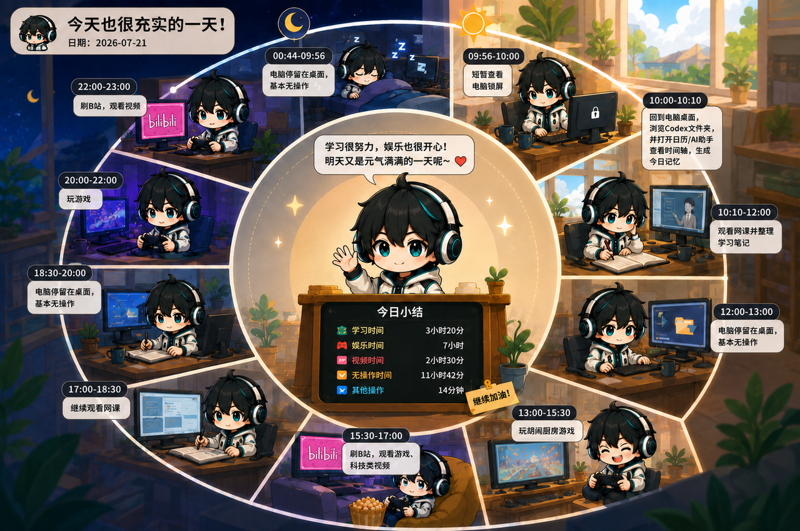

<div align="center">
  
  <h1>AI Jarvis（AI 贾维斯）</h1>
  <p>能看懂屏幕、听懂声音的本地全双工桌面助手。</p>
</div>

AI Jarvis 面向 Windows，通过本地多模态模型持续理解桌面画面与系统播放音频，并根据场景以桌宠气泡、游戏弹幕、课程笔记等方式提供帮助。核心感知与推理均在本机完成。

<p align="center">
  
</p>

## 主要功能

- **桌面陪伴**：结合实时屏幕画面与系统声音理解当前，在关键时刻给出提醒或点评。
- **游戏弹幕**：识别实时游戏场景，通过游戏弹幕提供交互，给你游戏主播的体验，系统也支持自定义游戏陪伴方案，例如你可以让它化身嘴臭教练、。
- **网课记录**：课程中给出当前课程内容提醒，课后给出带关键画面截图和总结的图文并茂的课程笔记。
- **本地记忆**：AI贾维斯能记住你的所有屏幕活动记录，生成日程总结并保存在本地。
- **日程图**：如果配置了图像生成API，可将日程总结生成为一张日程图。
- **音画屏蔽**：系统支持一键屏蔽功能，屏蔽后模型无法获得屏幕画面和声音。屏蔽功能通过双击桌宠即可开启，关闭屏蔽功能也是通过双击桌宠。

<p align="center">
  
  <br>
  <sub>日程总结图示例</sub>
</p>

## 全双工模型

项目使用 **MiniCPM-o 4.5** 的 GGUF 模型，由语言模型（LLM）、视觉模型（VPM）和音频模型（APM）共同处理文字、屏幕与声音。模型约每秒接收一帧画面和最近一秒的系统音频，并持续决定：

- `LISTEN`：继续观察，不打扰用户；
- `SPEAK`：输出一句与当前画面或声音有依据的简短文字。

这不是传统的“一问一答”。输入流会持续推进，模型可以延迟到真正需要介入时再响应。项目同时维护两个彼此隔离的模型上下文：

```text
DXGI 屏幕画面 + WASAPI 系统音频
                 |
                 +-- 结构化感知上下文 -> 场景 / 游戏 / 课程 / 记忆
                 |
                 +-- 全双工上下文     -> LISTEN / SPEAK -> 模型回复
```

## 快速开始

### 环境要求

- 64 位 Windows 10/11；
- 至少 12 GiB 可用磁盘空间和可用网络；
- 推荐 NVIDIA GPU 与 CUDA 12.8 以上版本；无 NVIDIA GPU 时会使用 CPU，但速度较慢。

首次启动会检查 Python 3.12+、Git、CMake、Visual Studio 2022 C++ Build Tools 和 CUDA。缺少组件时会通过 `winget` 自动安装，期间可能出现 UAC 提示或需要重启。

### 使用安装包（推荐）

1. 从项目发布页下载 `AI-Jarvis-Setup-<版本>-<架构>.exe`；
2. 运行安装程序并完成安装；
3. 启动 AI Jarvis，点击“启动 AI 贾维斯”。

安装包不包含模型权重。首次启动会自动下载并校验约 6.32 GiB 的 MiniCPM-o 4.5 模型，同时准备本地运行环境；具体耗时取决于网络和硬件性能。

### 从源码启动

源码运行还需要安装 Node.js 当前 LTS 版本与 npm。克隆仓库并进入项目根目录后执行：

```powershell
cd desktop
npm run deps:install
cd ..
.\start-real.cmd
```

打开桌面端后点击“启动 AI 贾维斯”。


## 项目组成

- `desktop/`：Electron 桌面端、桌宠、弹幕和托盘。
- `src/jarvis_backend/`：FastAPI 编排、场景策略、课程与记忆。
- `native/`：C++20 屏幕/音频采集、调度与本地推理。

## 致谢与引用

- [tc-mb/llama.cpp-omni](https://github.com/tc-mb/llama.cpp-omni)：提供基于 llama.cpp / ggml 的 MiniCPM-o GGUF 本地推理能力。本项目固定了上游版本，并以关闭语音输出的方式接入 LLM、VPM 与 APM。
- [OpenBMB/MiniCPM-V](https://github.com/OpenBMB/MiniCPM-V/)：MiniCPM-V / MiniCPM-o 官方项目，本项目使用其 MiniCPM-o 4.5 多模态与全双工能力。

更多设计细节见 [项目说明](PROJECT_OVERVIEW.md)。

## 许可证

本项目源代码采用 [MIT License](LICENSE)。
