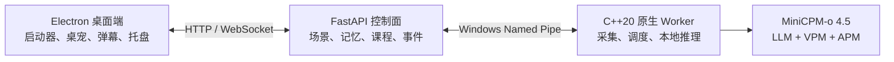

<p align="center">
  
</p>

<h1 align="center">AI Jarvis</h1>

<p align="center">
  面向 Windows 的本地优先多模态桌面 AI 助手<br>
  理解屏幕与系统声音，在合适的时机提供桌面提醒、游戏陪伴、课程笔记和本地记忆
</p>

<p align="center">
  
  
  
  
</p>

> [!IMPORTANT]
> AI Jarvis 仍处于早期开发阶段，主要面向开发者和愿意参与测试的用户。真实模型首次启动需要下载约 6.32 GiB 权重并在本机编译原生运行时，请在使用前阅读[运行要求](#运行要求)和[隐私说明](#隐私说明)。

## 项目简介

AI Jarvis 会在本机采集短时间窗口内的桌面画面与系统播放音频，并交给 **MiniCPM-o 4.5** 进行多模态理解。模型可以根据当前场景选择保持安静，或通过桌宠气泡、游戏弹幕、课程总结等形式提供信息。

核心感知和推理均在本机完成，不依赖 OpenAI、Anthropic 等云端大模型。只有“日程图”是可选的联网功能，并且仅在用户配置兼容的图像生成 API 后主动触发。

### 核心能力

- **屏幕与系统音频感知**：通过 DXGI 和 WASAPI loopback 获取实时上下文，不采集麦克风。
- **原生全双工陪伴**：模型持续选择 `LISTEN` 或 `SPEAK`，只在有明确证据且及时提醒有价值时显示简短文字。
- **游戏场景弹幕**：识别实时游戏并切换到点击穿透的透明弹幕层，支持为不同游戏配置陪伴提示词。
- **网课记录与总结**：自动记录课程转写与关键画面，在课程结束后输出可继续编辑的 Markdown 笔记。
- **本地活动记忆**：将稳定的活动观察整理为按日时间轴，支持历史浏览和检索。
- **可选日程图**：使用用户配置的兼容图像 API，将当日回顾生成可视化图片。
- **开放接口**：提供 FastAPI HTTP API 与 WebSocket 事件流，便于扩展其他界面或自动化工具。

更完整的功能、模型与产品边界请参阅[项目说明](PROJECT_OVERVIEW.md)。原生全双工的设计和验收标准见[全双工模式文档](FULL_DUPLEX_MODE.md)。

## 运行要求

| 项目 | 要求 |
| --- | --- |
| 操作系统 | 64 位 Windows 10/11 |
| Python | 3.12 或更高版本 |
| 桌面端开发 | Node.js 当前 LTS 版本与 npm |
| C++ 工具链 | Visual Studio 2022 C++ Build Tools |
| 构建工具 | CMake 3.24 或更高版本 |
| GPU | 推荐 NVIDIA GPU；CUDA 12.8+ |
| 磁盘空间 | 至少 12 GiB 可用空间 |
| 其他 | Git、联网下载依赖和模型；自动安装系统依赖时需要 `winget` |

没有 NVIDIA GPU 时可以使用 CPU 模式，但多模态推理速度会明显降低。当前原生 Worker 还要求项目及模型所在路径仅包含 ASCII 字符。

## 快速开始

### 运行完整桌面应用

下载或克隆仓库后，可直接双击根目录的 `start-real.cmd`。也可以在 PowerShell 中执行：

```powershell
cd desktop
npm run deps:install
npm start
```

打开应用后点击“启动 AI 贾维斯”。桌面端会调用根目录的 `start-real.ps1`：检查或安装所需工具、创建 Python 虚拟环境、下载并校验模型、构建 C++ Worker，然后启动本地服务。部分工具安装可能触发 UAC，安装完成后也可能需要重启 Windows 再次运行。

如果只需调试原生 Worker 与后端、不启动桌面界面，可运行：

```powershell
.\start-real.ps1
```

常用启动参数：

| 参数 | 说明 |
| --- | --- |
| `-CpuOnly` | 不使用 CUDA，以 CPU 模式构建和运行 |
| `-SkipInstall` | 不自动安装缺失的系统依赖 |
| `-SkipModelDownload` | 不下载模型；要求模型文件已经就位 |
| `-Rebuild` | 重新配置并构建原生 Worker |
| `-SkipSmokeTest` | 跳过真实文本推理冒烟测试 |

> [!NOTE]
> 一键启动器固定使用真实推理 Provider，并显式关闭 Stub Runtime。任何源码、补丁、模型校验或构建步骤失败时都会停止，不会静默回退到模拟推理。

### 模型目录

启动器会自动准备以下目录。模型权重不会提交到本仓库，也不会包含在桌面安装包中。

```text
models/MiniCPM-o-4_5-gguf/
├── MiniCPM-o-4_5-Q4_K_M.gguf
├── vision/
│   └── MiniCPM-o-4_5-vision-F16.gguf
└── audio/
    └── MiniCPM-o-4_5-audio-F16.gguf
```

如果模型仓库需要鉴权，可在启动前设置 `HF_TOKEN` 环境变量。不要将 Token、API Key 或本地配置提交到版本库。

### 下载源回退

依赖、构建资源和模型始终先尝试官方源。官方源连接超时或命令失败后，启动器会自动重试国内镜像；模型、便携 CMake 和第三方运行时仍须通过仓库中固定的 revision、文件白名单和 SHA-256 校验。

| 环境变量 | 默认值或作用 |
| --- | --- |
| `JARVIS_DOWNLOAD_TIMEOUT_SECONDS` | 单次网络无响应超时，默认 `60` 秒 |
| `JARVIS_HF_MIRROR` | `https://hf-mirror.com` |
| `JARVIS_GITHUB_MIRROR_PREFIX` | `https://gh-proxy.com/`，也可用包含 `{url}` 的代理模板 |
| `JARVIS_PYPI_MIRROR` | `https://pypi.tuna.tsinghua.edu.cn/simple` |
| `JARVIS_NPM_MIRROR` | `https://registry.npmmirror.com` |
| `JARVIS_ELECTRON_MIRROR` | `https://npmmirror.com/mirrors/electron/` |
| `JARVIS_ELECTRON_BUILDER_MIRROR` | `https://npmmirror.com/mirrors/electron-builder-binaries/` |
| `JARVIS_DISABLE_DOWNLOAD_MIRROR=1` | 禁用所有自动镜像回退 |

桌面依赖安装和安装包构建分别通过 `npm run deps:install` 与 `npm run build` 使用上述策略。也可以设置对应环境变量为内部镜像地址，官方源仍保持第一次尝试。
更新桌面依赖前需要先退出正在运行的 AI Jarvis；安装脚本会在清理 `node_modules` 前检查并阻止文件占用场景。

## 系统架构



- **Electron 桌面端**负责系统托盘、透明窗口、桌宠、弹幕和本地设置。
- **Python + FastAPI 后端**负责场景状态、交互策略、课程流程、记忆存储以及 HTTP/WebSocket 接口。
- **C++20 原生 Worker**负责 DXGI 屏幕采集、WASAPI 系统音频采集、任务调度和 MiniCPM-o 推理。

后端默认只监听 `127.0.0.1:8000`。主要 HTTP API 位于 `/api/v1`，事件 WebSocket 位于 `/ws/events`；可在配置中设置 `server.bearer_token` 保护本机接口。

## 目录结构

```text
AIJarvis/
├── desktop/              # Electron 桌面应用及 Node.js 测试
├── native/               # C++20 Worker、Windows 采集与原生测试
├── src/jarvis_backend/   # FastAPI 后端、编排、记忆和课程模块
├── tests/unit/           # Python 单元测试
├── third_party/runtime/  # 固定版本的推理运行时、补丁和许可信息
├── config/default.toml   # 默认开发配置
├── start-real.cmd        # Electron 桌面 APP 入口
├── start-real.ps1        # 桌面端托管的真实推理后端启动器
└── CMakeLists.txt        # 原生项目入口
```

## 开发指南

### Python 后端

默认配置使用 Fake Native Client，适合开发 API、场景、记忆和课程逻辑：

```powershell
py -3.12 -m venv .venv
.\.venv\Scripts\python.exe -m pip install -e ".[test]"
.\.venv\Scripts\jarvis-backend.exe
```

后端仅提供桌面端使用的本机 API，不再提供浏览器界面。默认配置位于 `config/default.toml`；自定义配置应复制到 Git 忽略的文件，并通过 `JARVIS_CONFIG` 指向它：

```powershell
$env:JARVIS_CONFIG = (Resolve-Path config\local.toml).Path
```

当前配置文件不会与 `default.toml` 自动合并，因此自定义文件需要包含完整配置。

### Electron 桌面端

```powershell
cd desktop
npm run deps:install
$env:JARVIS_DESKTOP_USE_FAKE = "1"
npm start
```

Fake 模式要求根目录的 `.venv` 已安装后端。若不设置 `JARVIS_DESKTOP_USE_FAKE`，桌面端会准备并连接真实本地推理环境。

构建 Windows NSIS 安装包：

```powershell
npm run build
```

安装包不包含模型权重，首次真实启动仍需准备模型和原生运行时。

### Native Stub 构建

Stub 仅用于原生组件开发和自动化测试，不提供真实模型推理：

```powershell
cmake -S . -B build -DJARVIS_ENABLE_STUB_RUNTIME=ON
cmake --build build --config Release
ctest --test-dir build -C Release --output-on-failure
```

真实 Provider 的来源、固定版本、补丁策略和离线构建边界见[运行时集成文档](third_party/runtime/INTEGRATION.md)。

## 测试

```powershell
# Python
.\.venv\Scripts\python.exe -m pytest tests/unit -q

# Electron
cd desktop
npm test

# C++（先完成 Native Stub 构建）
ctest --test-dir ..\build -C Release --output-on-failure
```

视觉测试可通过 `npm run test:visual` 执行。涉及真实模型语义、GPU 资源、锁屏、显示器或音频设备切换的测试仍需在 Windows 实机完成。

## 隐私说明

- 原始屏幕画面和系统播放音频只用于即时本地推理，普通运行不会将其作为录屏或录音长期保存。
- 课程流程只会保存被选中的关键画面，最终课程资料默认输出到桌面的 `Jarvis-Courses`。
- 活动记忆默认保存在 `memory/`，课程工作数据保存在 `courses/sessions/`；两者均被 Git 忽略。
- 用户暂停感知后，采集线程和已持有的采集对象会被停止或清理。
- 日程图是可选联网功能。主动生成时，当日回顾和两张项目参考图会发送给用户配置的图像 API。
- 日程图 API Key 由 Electron `safeStorage` 加密，历史图片元数据不会保存明文凭据。

请不要在处理敏感信息、受保密协议约束的内容或不允许屏幕采集的环境中开启持续感知。

## 当前限制

- 当前仅输出文字，不提供 TTS、语音克隆或实时语音对话。
- AI Jarvis 只观察并提供信息，不会点击、编辑或控制其他应用，也不会代替用户操作游戏。
- 场景分类、音频转写和课程总结可能出错，重要内容需要人工核对。
- CPU 模式可运行，但实时多模态体验取决于设备性能。
- 项目尚未完成多硬件环境下的广泛稳定性验证，不建议直接用于关键生产工作流。

## 参与贡献

欢迎提交 Issue 和 Pull Request。开始较大改动前，建议先通过 Issue 说明使用场景和实现方向，避免在产品边界或原生运行时方案上产生重复工作。

提交前请至少运行与改动相关的 Python、Electron 或 C++ 测试，并确保：

- 不提交模型权重、密钥、本地记忆、课程数据或构建产物；
- 新增行为有对应测试或清晰的手动验证记录；
- 第三方代码、模型和素材包含可追溯来源及兼容许可证；
- Windows 特有改动说明已验证的系统、显卡和音频环境。

## 许可证

本项目源代码采用 [MIT License](LICENSE)。第三方组件的版权与许可信息见 [THIRD_PARTY_NOTICES.md](THIRD_PARTY_NOTICES.md) 和 `third_party/runtime/` 下的对应文件。

**MiniCPM-o 模型权重不属于本项目 MIT 许可证的授权范围，也不随本仓库分发。** 下载、使用、商业部署或重新分发模型前，请单独阅读并遵守对应模型卡和权重许可条款。

---

如果这个项目对你有帮助，欢迎通过 Issue 分享实际硬件环境、使用场景和可复现的问题。
