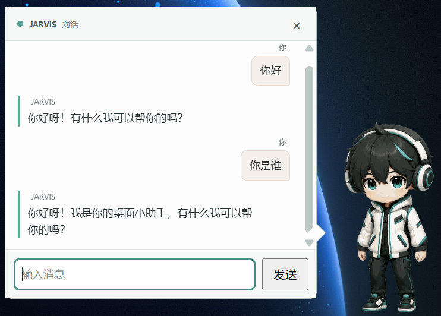

<div align="center">
  
  <h1>AI Jarvis（AI 贾维斯）</h1>
  <p><strong>能看懂屏幕、听懂声音的本地全双工桌面助手</strong></p>
  <p>面向 Windows · 本地多模态推理 · 桌宠交互 · 游戏陪伴 · 课程记录</p>
</div>

AI Jarvis 使用本地多模态模型持续理解桌面画面与系统播放音频，并根据当前场景，以桌宠气泡、游戏弹幕或课程笔记等方式提供帮助。日常的屏幕、音频感知与核心推理都在本机完成。


## 功能亮点

| 能力 | 说明 |
| --- | --- |
| **桌面陪伴** | 结合实时屏幕与系统声音理解当前场景，在合适的时机给出简短提醒或点评。 |
| **主动对话** | 按 `Ctrl+M` 在桌宠旁打开对话框，直接向本地模型提问并查看回复。 |
| **游戏陪伴** | 识别实时游戏场景，通过不干扰操作的透明弹幕提供提示和互动；可为不同游戏配置专属陪伴方案。 |
| **网课记录** | 课程中提供内容提醒，结束后生成包含关键画面与知识点总结的 Markdown 课程笔记。 |
| **本地记忆** | 从稳定的场景感知结果中整理活动时间线与每日总结；原始屏幕画面和音频不会写入长期记忆。 |
| **日程图** | 配置兼容的图像生成 API 后，可将当天总结生成为可视化日程图。 |
| **隐私模式** | 双击桌宠即可暂停或恢复屏幕与音频感知；暂停后模型无法继续获取画面和声音。 |

### 可视化日程

日程图将当天的活动时间线整理为一张便于回顾的图片。该能力默认关闭，只有在用户配置图像生成 API 并主动生成时才会联网。

<p align="center">
  
  <br>
  <sub>可视化日程图示例</sub>
</p>

### 与AI贾维斯对话

按 Ctrl+M 即可打开或关闭对话窗口，AI贾维斯会结合实时画面与你沟通。

<p align="center">
  
  <br>
  <sub>桌宠与主动对话界面</sub>
</p>


## 隐私与数据

- 屏幕画面和系统音频仅用于即时推理，普通运行不会长期保存原始采集数据。
- 课程模式只保存被选中的关键画面、整理后的知识点和画面说明。
- 可视化日程是独立的可选能力；只有主动生成时，当日回顾和项目角色参考图才会发送到用户配置的图像 API。

## 快速开始

### 环境要求

- 64 位 Windows 10/11；
- 支持 AVX2 指令集的 x64 处理器；
- 至少 12 GiB 可用磁盘空间；
- 首次启动时可连接网络，以下载约 6.32 GiB 的模型文件。

### 使用安装包（推荐）

1. 从项目发布页下载 `AI-Jarvis-Setup-<版本>-<架构>.exe`。
2. 运行安装程序并完成安装。
3. 启动 AI Jarvis，点击“启动 AI 贾维斯”。

安装包已包含 Python 后端和编译好的 C++ 推理运行时，不需要额外安装 Python、Git、CMake、Visual Studio 或 CUDA。模型权重不包含在安装包中；首次启动会自动下载、断点续传并校验 MiniCPM-o 4.5 模型，之后可直接运行。

> 安装版会优先尝试随包携带的 NVIDIA CUDA 推理运行时，并根据可用显存自动决定 GPU
> 卸载量。CUDA 初始化失败或没有兼容的 NVIDIA 显卡时会自动回退到 CPU，桌宠会明确提示
> 当前处于 CPU 模式，此时文本生成和持续感知速度会明显下降。

### Windows 前置依赖与故障排查

正常情况下先直接安装并启动，不要预先安装 Python、CMake 或 Visual Studio。只有启动失败、
CUDA 自动回退，或日志明确提示缺少 DLL 时，再按下面的顺序处理。

#### 1. 所有 Windows 用户

1. 确认系统是 64 位 Windows 10/11，处理器支持 AVX2，并预留至少 12 GiB 磁盘空间。
2. 安装微软官方的
   [Visual C++ 2015-2022 x64 运行库](https://aka.ms/vs/17/release/vc_redist.x64.exe)。
3. 安装完成后重启 Windows，再启动 AI Jarvis。
4. 首次启动需要下载约 6.32 GiB 模型。模型保存在
   `%LOCALAPPDATA%\AIJarvis\models\MiniCPM-o-4_5-gguf`，下载和校验期间不要强制结束程序。

#### 2. NVIDIA 显卡用户

1. 从 [NVIDIA 驱动下载页](https://www.nvidia.com/Download/index.aspx?lang=cn) 或 NVIDIA App
   安装最新驱动，安装后重启 Windows。
2. 打开 PowerShell，运行：

   ```powershell
   nvidia-smi
   ```

   能看到显卡名称、驱动版本和显存容量，说明驱动工作正常。若命令不存在或报错，先修复驱动，
   不要继续安装 Python 包。
3. 再次启动 AI Jarvis。程序会先尝试 CUDA；成功时运行日志显示“`NVIDIA CUDA 加速已启用`”。
4. 如果日志提示缺少 `cudart64_*.dll`、`cublas64_*.dll` 或 CUDA 初始化失败，可安装
   [CUDA Toolkit 13.x](https://developer.nvidia.com/cuda-downloads)。默认安装“Runtime”和
   “Development”组件即可，安装后重启 Windows。
5. 如果 CUDA 仍无法初始化，程序会自动改用 CPU，并通过桌宠气泡提示。此时功能仍可使用，
   但首帧感知和文本生成可能慢数十秒到数分钟。

RTX 50 系列建议使用 CUDA 13.x 和最新驱动。8 GiB 显存不应强制全量加载模型；AI Jarvis 会按
当前可用显存自动决定 GPU 层数。浏览器、游戏或其他 AI 程序占用大量显存时，先关闭它们再重试。

#### 3. 如何确认是否真的使用 GPU

1. 启动 AI Jarvis 并等待界面显示“环境感知已就绪”。
2. 在任务管理器的“性能 -> GPU”中查看“CUDA”计算图和“专用 GPU 内存”；不要只看默认的
   “3D”曲线。
3. 也可以在运行期间执行 `nvidia-smi`。若只有 CPU 使用率升高、GPU 显存没有明显增加，并且
   桌宠显示 CPU 提示，则已经触发 CPU 回退。

#### 4. 一直停在“正在检查本地模型”

1. 首次下载时先等待模型下载和哈希校验完成；机械硬盘或安全软件实时扫描会显著延长校验时间。
2. 确认 `%LOCALAPPDATA%\AIJarvis` 所在磁盘至少还有 8 GiB 空间。
3. 完全退出 AI Jarvis，在任务管理器中确认没有残留的 `AI Jarvis`、`jarvis-launcher` 或
   `jarvis-native-worker` 进程，然后重新启动。
4. 查看 `%LOCALAPPDATA%\AIJarvis\runtime\native-worker.log`。常见处理如下：

| 日志或现象 | 处理方式 |
| --- | --- |
| `CUDA initialization failed`、显存不足 | 关闭占用显存的程序并重启；仍失败时允许 CPU 回退 |
| 缺少 `cudart` / `cublas` DLL | 更新 NVIDIA 驱动，必要时安装 CUDA Toolkit 13.x |
| 缺少 `VCRUNTIME140.dll` / `MSVCP140.dll` | 安装 Visual C++ 2015-2022 x64 运行库 |
| 模型校验失败 | 退出程序，删除不完整的模型目录后重新下载 |
| 日志长时间停在视觉或音频编码 | 通常是 CPU 回退；先修复 CUDA，或等待当前推理完成 |

### 从源码启动

源码运行需要 Python 3.12+、Git、CMake 3.24+、Visual Studio C++ Build Tools、Node.js
当前 LTS 版本与 npm。构建 Windows 安装包还需要 CUDA Toolkit 13.1 或更新版本；CUDA 运行库
会被复制进安装包，最终用户不需要安装 Toolkit。

在项目根目录执行：

```powershell
cd desktop
npm run deps:install
cd ..
.\start-real.cmd
```

桌面端打开后，点击“启动 AI 贾维斯”。服务就绪后可以拖拽桌宠调整位置，并通过 `Ctrl+M` 打开或关闭对话框。

## 工作原理

项目使用 **MiniCPM-o 4.5** GGUF 模型，由语言模型（LLM）、视觉模型（VPM）和音频模型（APM）共同处理文字、屏幕与声音。模型约每秒接收一帧画面和最近一秒的系统音频，并持续选择：

- `LISTEN`：继续观察，不打扰用户；
- `SPEAK`：输出一句有当前画面或声音依据的简短文字。

这不是传统的“一问一答”。输入流会持续推进，模型可以等到真正需要介入时再响应。结构化场景判断与全双工对话使用彼此隔离的模型上下文：

```text
DXGI 屏幕画面 + WASAPI 系统音频
                 |
                 +-- 结构化感知上下文 -> 场景 / 游戏 / 课程 / 记忆
                 |
                 +-- 全双工上下文     -> LISTEN / SPEAK -> 模型回复
```

当前版本以文字交互为主，不提供语音播报或实时语音对话；游戏陪伴只提供观察、提示与互动，不会直接控制游戏或代替用户操作。

## 开发与构建

### 构建 Windows 安装包

发布构建需要 Python 与 C++ 工具链。以下命令会构建静态 MSVC/CPU 原生运行时、冻结 Python 后端，并生成 NSIS 安装程序：

```powershell
cd desktop
npm run deps:install
npm run build
```

产物位于 `desktop/dist/AI-Jarvis-Setup-<版本>-x64.exe`。发布构建不会把源码、编译器或本地运行数据装入安装包。

构建完成后，可执行隔离安装验证。该命令会把程序安装到临时目录，在移除 Python、虚拟环境和构建工具环境变量后检查自包含运行时，并在完成后自动卸载：

```powershell
npm run verify:installer
```

如需同时验证首次模型下载、原生推理进程和后端健康状态，执行：

```powershell
npm run verify:installer -- -FullStartup
```

### 项目结构

```text
AIJarvis/
├── desktop/             Electron 桌面端、桌宠、弹幕与系统托盘
├── src/jarvis_backend/  FastAPI 编排、场景策略、课程与本地记忆
├── native/              C++20 屏幕/音频采集、调度与本地推理
├── config/              默认配置
├── docs/                项目文档与展示图片
└── tests/               Python 测试
```

更完整的架构、数据流与能力边界见 [项目说明](PROJECT_OVERVIEW.md)，参与开发前请阅读 [贡献指南](CONTRIBUTING.md)。

## 致谢

- [tc-mb/llama.cpp-omni](https://github.com/tc-mb/llama.cpp-omni)：提供基于 llama.cpp / ggml 的 MiniCPM-o GGUF 本地推理能力。本项目固定了上游版本，并以关闭语音输出的方式接入 LLM、VPM 与 APM。
- [OpenBMB/MiniCPM-V](https://github.com/OpenBMB/MiniCPM-V)：MiniCPM-V / MiniCPM-o 官方项目；本项目使用其 MiniCPM-o 4.5 多模态与全双工能力。

## 许可证

项目源代码采用 [MIT License](LICENSE)。第三方组件及模型的许可边界见 [第三方声明](THIRD_PARTY_NOTICES.md)。
